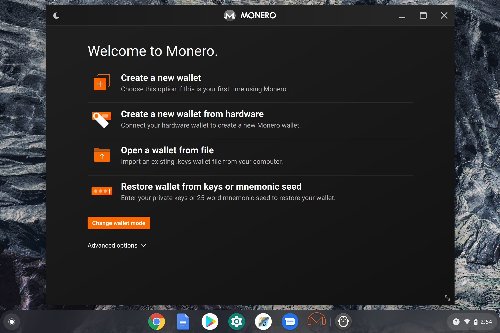

# Monero GUI on a Chromebook with Crostini
[Crostini](https://chromium.googlesource.com/chromiumos/docs/+/master/containers_and_vms.md#Crostini) is the umbrella term for making Linux application support easy to use and integrating well with Chrome OS.



## Security
While running arbitrary code is normally a security risk, the Crostini project has come up with a runtime model that sufficiently mitigates & contains the code. The VM is the security boundary, so everything inside of the VM is considered untrusted. The current VM guest image is also running our hardened kernel to further improve the security of the containers, but we consider this a nice feature rather than relying on it for overall system security.

For more information about Crostini security features have a read [here]('https://chromium.googlesource.com/chromiumos/docs/+/master/containers_and_vms.md#Security')

## Installation

### Enable Linux on Chrome
Note: this feature is still in BETA so proceed at your own risk.

[Setup Linux on your Chromebook](https://support.google.com/chromebook/answer/9145439?hl=en)

### Launch the Crostini Terminal
This may take a moment, as the virtual machine and container need to be started if they have not been already.

  * Open the Application Menu
  * Search for Terminal
  * Launch the Terminal application

### Run the install script
This helper will pull the latest Monero GUI release tar ball, extract, and configure the desktop shortcut.

```
git clone https://github.com/fnodes/monero-gui-crostini
```

```
cd monero-gui-crostini
```

```
./install.sh
```


### Running Monero GUI
The Monero GUI application now has a shortcut in the Chrome application launcher

  * Open the Application Menu
  * Search 'Monero'
  * Launch the 'Monero' application

## Configuration

### Remote Node
If you don't have enough resources to sync the entire blockchain, configure a remote node. This option can be found under the 'Settings' menu.

Fullnodes.io maintains an open source containerized [Monero daemon](https://github.com/fnodes/monero). The resulting image is only ~66MB compressed and is a great option for running a headless node.

### Daemon Mode
Some Chromebooks sport 512GB+ of fast SSD storage. In this case, it may make sense to run the Monero GUI in daemon mode and sync the blockchain locally.

### Ledger Support
In ChromeOS 72, there will be support for sharing access to USB devices with Linux applications. Once this lands in the stable channel, this repo will be updated with instructions on how to enable the Ledger.


